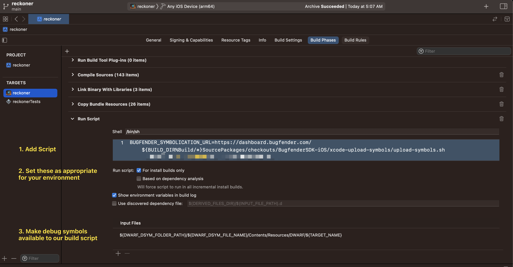

Bugfender iOS Symbols Upload Script
===================================

Used to automatically upload dSYM bundles to [Bugfender](https://bugfender.com).

## Usage

A Symbols Upload Token obtained from the Bugfender Dashboard needs to be specified either as a first argument to the script
or the `BUGFENDER_API_KEY` environment variable.

```sh
$ ./upload-symbols.sh <TOKEN>
```

```sh
$ BUGFENDER_API_KEY=<TOKEN> ./upload-symbols.sh
```

The script is generally meant to be called from XCode build environment.

To have it run automatically during build:

* Go to your App settings.
* Select *Target* from the left.
* Go to *Build Phases*.
* Open menu under the `+` sign and select *New Run Script Phase*.
* Under the shell portion of *Run Script* add a script call as described above.
    * It is also possible to drag & drop it from Finder and XCode will fill in the path. 
* Done!


